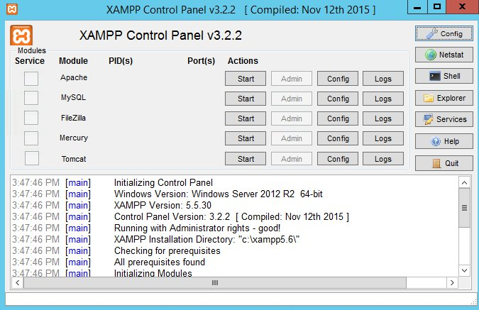

[](https://github.com/ToiOhomaiBCS/COMP6210-Course-Material/raw/master/week01/session01/readme.pdf)

# Setting up your Development Environtment

To run a PHP script you need a server-side environment on your machine.

There are 3 methods you can use to set this up:

1. Use a *AMP stack package that installs the environment for you.
2. Install PHP directly on your machine and control it using the CLI
3. Run PHP via container system like Docker

# 1. Installing an *AMP stack package

*AMP stands for Apache, MySQL and PHP. The * indicates the system you are running it on.  
So for Windows there is WAMP, for Mac there is MAMP and Linux has LAMP.

There is a cross platform package called XAMPP, the X indicates cross platform, the second P is for PERL.

In the computer labs, the machines come with XAMPP, so if you want to just get started - use that.

If you need to install it on your own machine go [here](https://www.apachefriends.org/download.html) for the full installation or [here](https://portableapps.com/apps/development/xampp) for the portable installation, so that you could run it in a user environment without requiring admin rights.

Once it is installed - or if you are using the preinstalled version on the lab PC, you can find it by clicking on the start menu and typing XAMPP.

This will open the XAMPP control panel which looks like this:



Once you click start your server is up an running and you can store your webfiles in the htdocs folder which should be located in your H: drive. **Note: this will appear after you run a script, if it is not there already**

Although this method is simple and easy to setup. As written [here](https://www.apachefriends.org/hosting.html) XAMPP is not recommended for a production setup. Although this is not problem when you are learning PHP - it will need to tested before you submnit your assessment.

**NOTE** In the K Drive there is a COMP.6210 folder that has a script in it that moved the HTDOCS and the right permissions for your user account. You MUST run this to protect your work, or else anyone has access to it.

# 2. Installing PHP using the CLI

The second method to run PHP on your pc is to download directly on your machine.

There are several advatages of this method:

* You will be able to run PHP from anywhere on your machine.

* You get familiar with using the command line

There is also a disadvantage, which is: You will other things on your PC that may allow your project to work, but may not be part of your eventual production setup. Although this is not problem when you are learning PHP - it will need to tested before you submnit your assessment.

To setup PHP locally on your machine you will need to install it. This method is slightly different depending on the operating system you use. So click on the link below that matches your system.

* [Install it on Windows](../extra/01a-Install-PHP-on-Windows.pdf)

* [Install it on Linux (Debian System)](../extra/01b-Install-PHP-on-Linux-Debian.pdf)

* [Install it on macOS ](../extra/01c-Install-PHP-on-macOS.pdf)

# 3. Using a container system like Docker

Docker is a container system that allows you to run issolated systems on your own system. This means that you can make a website or a service run on your machine, just like it would do once you deploy it into production.

To create a docker script is outside of this course, but you can download a LAMP stack by copying the following command into the docker-terminal.

To use the docker container you need to do the following:

1. Download docker onto your system:

    * For windows click [here](https://github.com/docker/toolbox/releases/download/v18.09.3/DockerToolbox-18.09.3.exe)

    *Note: this will also install Virtualbox and Git if you do not have them installed already*

    * For macOS click [here](https://download.docker.com/mac/stable/31259/Docker.dmg)

    * For linux read through the instructions [here](https://docs.docker.com/install/linux/docker-ce/ubuntu/)

2. Get the PHP setup

In the terminal (Docker toolbox in Windows or the one that comes with your OS otherwise) set an environment variable for FOLDER.

```
FOLDER=PHP101 //PHP101 is just an example
```

Then download the setup in whatever folder you want.

```
curl -LOk https://github.com/to-jk11/php-container-kit/archive/master.zip && unzip master.zip && rm -f  master.zip && mv php-container-kit-master $FOLDER && mkdir -p $FOLDER/www
```

# Running your PHP server

If you are using XAMPP, php locally or docker on mac or linux, you can access your server in the browser by typing http://localhost:8000

If you are using Docker toolbox for Windows you will need to type in http://192.168.99.100:8000

# Take aways

As mentioned above using XAMPP is probably the simplest method, but in the long run it is also the least useful. 

You will need to learn to debug any errors you may run into when running your setup.

It does not matter what choice of setup you use for your assignments, but you must test it on another machine to make sure it works and in your report, you must include **CLEARLY** in your report.